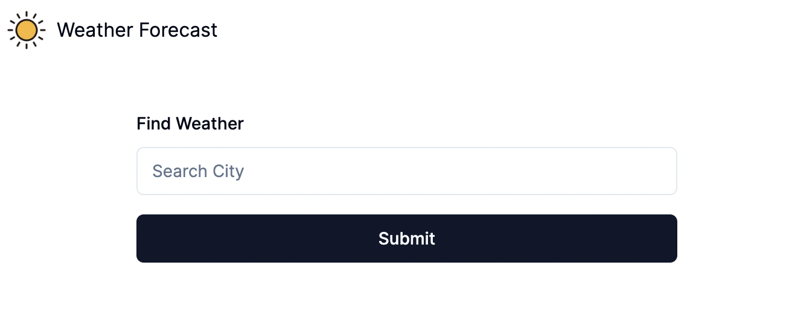

# Closed.AI Coding Challenge

## Setup
### Backend

Copy *.env.example* to *.env* inside `backend` directory and put ACCU_API_KEY and GIPHY_API_KEY:

```
ACCU_API_KEY=[API_KEY_HERE]
GIPHY_API_KEY=[API_KEY_HERE]
CITY_SEARCH_URL="http://dataservice.accuweather.com/locations/v1/cities/search"
FORECAST_URL="http://dataservice.accuweather.com/forecasts/v1/daily/1day/"
GIPHY_URL="https://api.giphy.com/v1/gifs/search"
```


### Frontend

Copy *.env.example* to *.env.local* inside `frontend` directory.

This time we're running the backend locally so no need to change the URL but when deployed in another environment, the backend URL should be changed accordingly.

```
NEXT_PUBLIC_BACKEND_URL='http://localhost:8000'
```


## Run the application
### Backend
Run the following command inside `backend` directory in a terminal.
```
uvicorn app.main:app --reload
```

### Frontend
Run the following command inside `frontend` directory in a separate terminal.
```
npm run dev
```

## UI

Following screen should be accessible through http://localhost:3000

